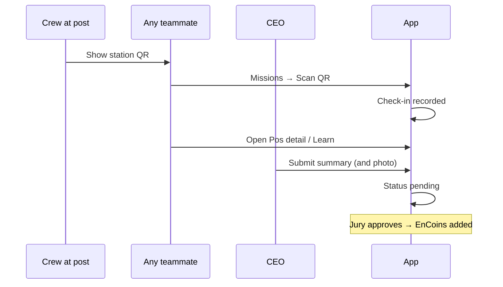

# Participant guide

For students on a team using the EnTripreneurship app during the event.

**App URL:** https://entripreneurship.fun  
**Best on:** Phone browser (install as PWA from browser menu if offered).

---

## What you use the app for

| Area | Purpose |
|------|---------|
| **Login** | Prove you registered (WhatsApp) |
| **Team** | Join or create a startup team (max 6, fixed roles) |
| **Missions** | Visit 7 stations, check in, submit work |
| **Learn** | Read official **case studies** (Pos 1) and **innovation cards** (Pos 3) |
| **Bank** | Team **EnCoin** balance, QR pay/receive |
| **Map / Leaderboard / Prizes** | Orientation and competition info |

**EnCoins** are points. You earn them when a jury/crew **approves** your station submission. You spend them by scanning payment QRs (shop, transfers) with your **6-digit PIN**.

---

## Login (first time)

Participants do **not** use email/password.

1. Open **Login**.
2. Enter your **WhatsApp number** (same as on the registration form, Indonesian format e.g. `628…`).
3. If you see “not on registration list”, ask registration desk to add you (admin can add participants).
4. The app shows a **6-character code** and an **Open WhatsApp** button.
5. Send the exact message to the event bot (e.g. `Hi Connext! Let me login to entripreneurship.fun (XXXXXX)`).
6. When the bot confirms, the browser continues automatically.

Technical detail: [WHATSAPP_LOGIN.md](./WHATSAPP_LOGIN.md).

---

## Onboarding (after login)

### Step 1 — Transaction PIN

- Choose a **6-digit PIN** (used for payments and QR sessions).
- Enter twice to confirm.
- **Do not share** this PIN; crew never need your PIN for station approval (only for bank-style QR flows).

### Step 2 — Team

**Create a team (you become CEO)**

- Enter a team name → you get a **join code** to share.

**Join an existing team**

- Enter the join code from your CEO.
- Pick an open role: **CEO, CTO, CFO, CMO, COO, CPO** (one person per role, max 6).

### Step 3 — Done

You land on **Home** with your team name and balance (starts at 0).

---

## Roles — who can do what

| Action | Who |
|--------|-----|
| Scan **station QR** to check in | Any team member |
| **Submit** station work | **CEO only** |
| Show team QR / scan to pay | Any member (PIN required) |
| Read learn materials | Anyone |

If you are not CEO, Missions will show who can submit.

---

## Navigation

Bottom bar:

- **Home** — balance, quick actions, active mission hint
- **Missions** — all 7 Pos stations
- **Bank** — EnCoins
- **More (Profile)** — team roster, join code, theme, PIN change, links to Map / Learn / Prizes / Leaderboard

**Profile → CASE STUDIES & CARDS** opens the full booklet in the app.

**Theme:** Profile includes **light/dark** toggle (use light mode outdoors if contrast is hard).

---

## The 7 stations (missions)

| Pos | Name | In-app materials | Submission |
|-----|------|------------------|------------|
| 1 | Emphatize | **Case study** (pick one company) | Summary (+ photo if required) |
| 2 | Define | — | Summary |
| 3 | Ideate | **Innovation card** (same company as Pos 1) | Summary (+ photo if required) |
| 4 | Prototype | — | Summary + photo |
| 5 | Market Test | — | Summary |
| 6 | Reflection | — | Photo |
| 7 | Future Innovation | — | Summary (higher reward) |

### Standard flow at every Pos

1. **Check in** — Missions → **SCAN QR** (or scan from Pos page). Scan the **poster/tablet QR** at that station (not another team’s QR).
2. **Do the activity** — read materials, complete the physical task.
3. **Submit** — CEO opens that Pos → writes the required summary (and uploads photo if needed) → submit once.
4. **Wait** — Status **pending** until jury approves → **approved** (+ EnCoins) or **rejected** (CEO can resubmit).

You **cannot** submit without checking in first.

### Pos 1 — Case study

On the Pos 1 mission page (and under **Learn**):

- Five companies: **Tesla, Netflix, OpenAI, Uniqlo, RON88**
- Each card includes: company profile, case context, and a **discussion question** (your empathy task)
- Agree with your team **which company** you are using for the whole journey

### Pos 3 — Innovation card

- Open the **same company** as Pos 1
- Read all innovation sections (multiple cards per company)
- Brainstorm; CEO documents **top 3 ideas** in the submission

Cross-links in the app jump between case study and innovation card for the same company.

---

## Learn (booklet in the app)

Path: **More → CASE STUDIES & CARDS** or **Home → Learn**.

- **Case studies** — for Pos 1 (Empathize)
- **Innovation cards** — for Pos 3 (Ideate)

Tap a company → full-screen readable content (Win98-style panels). No internet needed after load if PWA cached.

---

## Bank (EnCoins)

### Balance

Team balance is shared. Shown on Home and Bank.

### Show My QR

- Creates a short-lived payment session.
- Another participant or crew scans it to send coins **to your team** or to charge you (shop).

### Scan QR

- Scan another team’s or crew’s QR.
- Confirm amount → enter **your PIN**.
- Used for peer transfers or paying at the event shop.

### History

Recent transactions for your team.

**Mechanism:** Transactions are rows in the database; approved station rewards and crew “reward” scans increase balance; spends/transfers decrease it (see migration `007` for spend rules).

---

## Map & leaderboard

- **Map** — event map image, station pins, optional GPS dot for you, team ping from latest location share.
- **Leaderboard** — team rankings (event logic may weight Pos 7 completion).
- **Prizes** — categories (richest, fastest through stations, most innovative, best outfit).

Location: app may send periodic location pings while you are logged in (for crew map). Allow browser location if prompted.

---

## Submission statuses

| Status | Meaning |
|--------|---------|
| (no submission) | Not submitted yet |
| Checked in | QR scanned; CEO can submit |
| Pending | Waiting for jury review |
| Approved | EnCoins credited for that Pos |
| Rejected | Read note; CEO fixes and resubmits |

---

## Troubleshooting

| Problem | What to do |
|---------|------------|
| Not on registration list | Registration desk / admin adds your WhatsApp |
| WhatsApp login stuck | Resend exact message; code expires in 10 minutes |
| Cannot submit | Scan station QR first; only CEO submits |
| PIN locked | Wait 5 minutes after 5 wrong attempts |
| Balance wrong after shop | Ask bank crew; they can deduct with crew tools |
| Materials not loading | Refresh; Learn works from built-in content |

---

## Privacy & safety

- Use your own PIN; crew rewards use **crew PIN**, not yours.
- Do not share join codes publicly if you do not want random joins.
- Log out is under Profile if you use a shared phone (participants typically stay logged in for the day).
