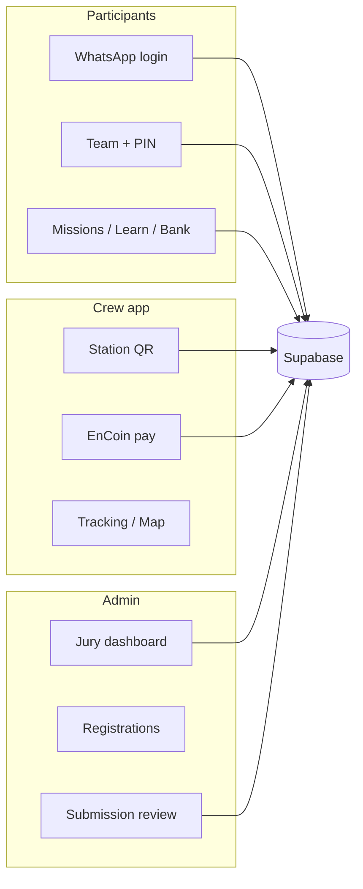

# EnTripreneurship Vol. 02 — Documentation

End-to-end guides for the participant PWA at **https://entripreneurship.fun** (or local `http://localhost:3000`).

| Audience | Guide | Login |
|----------|--------|--------|
| **Participants** (teams) | [GUIDE_PARTICIPANT.md](./GUIDE_PARTICIPANT.md) | WhatsApp OTP |
| **Crew** (field staff) | [GUIDE_CREW.md](./GUIDE_CREW.md) | Email + password |
| **Admin / jury** | [GUIDE_ADMIN.md](./GUIDE_ADMIN.md) | Email + password |

## What this app is

A mobile-first **Progressive Web App** for the BINUS EnTripreneurship event. Teams of up to six students:

- Move through **7 Design Thinking stations** (Pos 1–7) on campus
- **Check in** at each post by scanning a station QR
- Read **case studies** (Pos 1) and **innovation cards** (Pos 3) in the app
- Submit work (**CEO only**) for crew/jury approval
- Earn **EnCoins** when submissions are approved
- Spend EnCoins via **QR payments** at the bank desk or event shop

Crew run stations, track movement, and pay teams. Admins run the **jury dashboard**: roster, crew assignments, and submission review.

## Architecture (short)



## Related technical docs

| Topic | File |
|--------|------|
| WhatsApp + n8n webhook | [WHATSAPP_LOGIN.md](./WHATSAPP_LOGIN.md) |
| Station QR check-in | [STATION_QR.md](./STATION_QR.md) |
| Premade crew/admin accounts | [CREW_LOGINS.md](./CREW_LOGINS.md) |
| Automated smoke tests | [TESTING.md](./TESTING.md) |

## Verification before event day

```bash
npm run dev          # terminal 1
npm run test:e2e     # participant API flow
npm run test:smoke-docs   # participant + crew + admin APIs
npm run verify:supabase   # DB seed checks
```

See [TESTING.md](./TESTING.md) for what each test proves.
